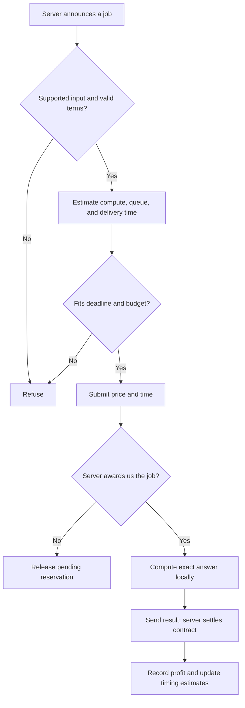

# How Auctioneers works

Start here to understand the agent. Use the [README](README.md) to run it, the [optimization report](OPTIMIZATION_PROOF.md) for mathematical arguments and measurements, and [practice notes](PRACTICE_NOTES.md) for the history of our experiments.

**Current default:** `competitive` pricing and optimized sorting have been added. Read [the current strategy](COMPETITIVE_STRATEGY.md) for the exact feedback and hash-risk formulas. Earlier practice results below describe their named historical modes.

## The assignment in one minute

The course server offers computing jobs with a budget and deadline. Our program either declines or submits a price and estimated delivery time. If we win, Charles's M1 Pro computes the answer locally and returns it. The server checks the answer and records payment, time cost, and any penalty.

Our objective is profit. Winning a job helps only if its payment exceeds its costs and penalties. The code makes these decisions automatically; the website is a dashboard, and GitHub is where we collaborate.

Our team name is `Auctioneers`. Use it consistently. Only one machine should run under that name at a time. The tested environment is the existing Python 3.9.6 virtual environment on Charles's M1 Pro; this is our verified runtime, not a claim that the assignment mandates that version. Our group has instructor approval for three members, as confirmed by Charles.

## One job, from announcement to payment



We also refuse new work when stopping or when a current computation has already exceeded its predicted duration. A bid is a potential commitment: if a bid submitted before a stop request wins, we still perform the work.

## Our current price and time formulas

The legacy `--pricing markup` formula, also used as the non-hash minimum in competitive mode, is:

```text
compute estimate = raw timing model × learned correction for this task type
delivery estimate = queued time + compute estimate + delivery allowance
estimated cost = delivery estimate × manager's cost_rate
price = estimated cost × 1.28
```

The delivery estimate is rounded upward to four decimal places; the price is rounded to four decimal places. We check the deadline and budget after rounding as well. This matches the precision used by the SDK.

For example, suppose we have 0.5 seconds queued, expect 1 second of computation, and allow 0.08 seconds for delivery. We quote 1.58 seconds. At a cost rate of 1 credit per second, our bid is `1.58 × 1.28 = 2.0224` credits. We decline if that price exceeds the budget or that time exceeds the deadline.

The 1.28 multiplier means a **28% markup on estimated cost**. Charles chose it as an experiment. It is not a guarantee of profit: if the actual billed cost exceeds the price, a correctly delivered job can still lose money.

The manager's default auction score is:

```text
score = price + time_weight × estimated delivery time
```

Lower wins. At `time_weight = 2`, the example above scores `2.0224 + 2 × 1.58 = 5.1824`. This explains why speed lets us compete while charging more. **The baseline mode uses the flat 1.28 rule.** The experimental `--pricing adaptive` mode described below adjusts prices from outcomes. Neither mode reconstructs competitors' scores or optimizes the scoring formula. The server applies its actual award policy.

## Experimental adaptive pricing

Run with `--pricing adaptive` to test a different price while keeping the same execution, time estimates, and refusal rules:

```text
minimum = baseline 1.28 price
price = minimum + share × (budget rounded down to four places − minimum)
```

Each task type starts with `share = 0.50`. A correct delivery increases its share by 0.05, up to 0.95. Losing to another named contractor with a valid winning price decreases it by 0.10, down to zero. Invalid bids, missing winners, and failed deliveries do not change the share. Pending quotes are removed as before. Learning resets on restart.

For a 4.41-credit matrix budget and a 0.21 minimum, the starting price is 2.31 credits. The work and estimated delivery time stay the same. If nobody else bids, charging more earns more for the same execution; with competition, the higher auction score may lose. The downward adjustment responds to losses, but a loss may be caused by a faster competitor rather than price alone. The winner's price alone cannot reveal their delivery-time score.

These step sizes are an experiment, not a fitted optimum. Different task sizes and changing competitors can confuse per-type feedback. We preserve the baseline minimum even if repeatedly undercut; this may mean accepting no work. That minimum is still based on uncertain runtime, so neither mode guarantees a profit. See [pricing experiment](PRICING_EXPERIMENT.md) for checks and practice evidence.

## How we estimate computation

At startup, before connecting, we run small synthetic calibration jobs on this machine. These are independent calibration inputs, not answers cached from practice announcements.

For matrices, the reference's cubic work model no longer describes our faster algorithm. We measure seconds per n-squared unit using dimensions 96 and 192, with separate buckets for moduli of at most 32 bits and larger moduli up to 64 bits. Each case is measured three times; we use its median, then the largest coefficient within the bucket. This gives a conservative starting estimate, not a mathematical upper bound on runtime.

For primes, we separately measure a coefficient for base-prime generation and segment setup, and a coefficient for marking the interval. The prediction accounts for the square root of the upper bound, the number of segments, and the interval width. Both optimized models add a small 0.0005-second fixed allowance.

Hashing retains the supplied implementation and SDK calibration. Monte Carlo now batches Python's exact random draws through NumPy float64 arithmetic when installed, with a calibrated Python fallback. See the [Monte Carlo proof](MONTE_CARLO_PROOF.md). Sorting now uses exact rejection sampling and one final modular reduction, with an additional startup timing model described in the current strategy. The benchmark number reported during registration still comes from the SDK's standard calibration; the fast executors have additional timing models inside our agent.

Calibration can become inaccurate as the laptop heats up or other applications consume resources. Ten holdout cases supported the new models in local tests; those checks cannot guarantee every future deadline.

## Why the faster algorithms are correct

### Matrix checksum

The task asks for the sum of the product matrix's entries, modulo a number. It does not ask us to return the product matrix itself.

That sum equals the dot product of the first matrix's column sums and the second matrix's row sums. We generate exactly the same random entries, in the same order as the reference, and calculate that expression using exact Python integers. Generating the inputs takes quadratic work; the reference's full multiplication takes cubic work.

For a 260-by-260 case, repeated measurements showed about 20 times faster computation. The [proof](OPTIMIZATION_PROOF.md#1-matrix-correctness-argument) derives the identity and explains why moving the modular reduction does not change the answer.

### Prime count

The reference tests individual numbers by trial division. Our sieve marks multiples of small primes in chunks and counts the entries that remain unmarked. Every composite has a sufficiently small prime factor, so every composite is marked and every prime remains.

Starting each prime's marking at its square, or the first appropriate multiple in the chunk, prevents us from marking the prime itself. Fixed-size chunks bound the interval memory. See the [prime proof](OPTIMIZATION_PROOF.md#2-prime-count-correctness-argument).

We never access a private answer key, reuse a stored answer, or change the supplied random sequence. The unchanged server-facing SDK sends exact results as decimal strings, preserving integers larger than JSON numbers can represent exactly.

## What we learn after a successful job

The worker records local compute time. The server separately reports its measured delivery time and settlement. We keep those measurements distinct.

For non-hash tasks, we compare local compute time with the **raw** timing model, not the already corrected bid. The update is:

```text
observed ratio = local compute time / raw model estimate
bounded ratio = limit observed ratio to the range 0.5 through 4.0
new correction = 0.8 × old correction + 0.2 × bounded ratio
```

Each task type has its own correction, initially 1.0. The bounds reduce the effect of extreme observations; they also mean learning cannot instantly account for an arbitrarily large slowdown. Only correct settlements with a matching local measurement train this correction.

When the quoted queue was empty, `server runtime − local compute time` estimates the remaining overhead: network transit, worker scheduling, and other delivery delays. We retain the last 20 such observations. After at least three observations, the allowance becomes their 90th percentile plus 0.02 seconds, with a minimum of 0.05 seconds. Before that, it is 0.12 seconds.

These constants are starting heuristics, not optimized guarantees. Using a high percentile helps cover typical variation while avoiding reliance on the fastest observed connection. It does not cover every network outage. Known queued work is excluded from overhead learning so queue time is not mistaken for network delay.

## Queue, reconnect, and shutdown behavior

We reserve time for pending bids as well as awarded contracts, and execute work serially. Each reservation now contributes only its own compute estimate and delivery allowance. We do not add the earlier queue embedded in its original delivery quote a second time. Partial running work is subtracted, overruns still block new bids, and a missing quote falls back to the SDK reservation. This remains conservative because pending bids may lose; it is not an optimal scheduler for simultaneous auctions.

Our additional guard refuses new promises while a running computation exceeds its predicted duration. Otherwise the SDK's remaining-time estimate would clamp to zero and could make a busy machine appear free. If timed-out work is still running, we account for it even after its commitment was removed.

On reconnect, we discard local reservations for unawarded bids while preserving awarded work. The SDK replays currently open announcements and handles reconnecting and result delivery. Duplicate award messages are prevented from enqueuing the same work twice. If an auction closes between registration replay and bid arrival, an identified `bidding_closed` error releases only that unawarded reservation. Unidentified errors and already awarded work are preserved.

We also fixed a Python 3.9 compatibility issue by creating the SDK's initially empty work queue on the running event loop, inside our subclass. The SDK files themselves are unchanged.

On the tested macOS runtime, Ctrl+C or SIGTERM asks the agent to stop taking new work and wait for outstanding bids and contracts to settle. This matters because a bid can win after it was submitted: closing the process immediately can leave an awarded job undelivered. Graceful shutdown may take time while outstanding work or network recovery completes. Wait for the process to exit before starting another copy.

## Input limits and refusal

These are our implementation's resource limits, not promises about the course server's task pool. Unsupported work is refused before we bid.

| Task | Accepted bounds |
|---|---|
| Matrix | Integer n from 0 through 2048; positive integer modulus below 2^64; integer seed with at most 64 bits of magnitude |
| Prime count | Integer endpoints; upper bound at most 10^12; effective interval width at most ten million after clamping the lower endpoint to 2 |
| Monte Carlo | Integer sample count from 0 through fifty million; integer seed with at most 64 bits of magnitude |
| Sort checksum | Integer n from 0 through five million; integer seed with at most 64 bits of magnitude |
| Hash search | Integer threshold from 1 through 2^32; string or integer seed whose string representation is at most 128 characters |

Malformed inputs, unknown task types, invalid budgets/deadlines/cost rates, missing calibration, unaffordable bids, and estimates past the deadline also cause refusal. A deadline comparison is based on a prediction, not certainty that a particular job will finish.

## Hash search: modelled risk, with remaining uncertainty

Each hash attempt succeeds with probability `threshold / 2^32`, so the expected number of attempts is `2^32 / threshold`. A particular instance can take much longer or much less than that average.

We retain the reference hash executor and its throughput calibration. We deliberately do not learn a compute correction from individual hash runtimes: a lucky or unlucky seed should not redefine how fast our machine hashes.

The default competitive mode now requires a modelled on-time success probability of at least 0.95 and includes expected failure penalties in its minimum price. See the [exact formulas and limitations](COMPETITIVE_STRATEGY.md#hash-search-account-for-the-distribution). The legacy modes retain their original expected-work pricing. Neither model guarantees delivery on unseen seeds; timing error and the relationship between budgets, deadlines, and measured task difficulty remain important.

## Where to find each part in the code

All submitted logic is in [my_contractor.py](contract-net/student/my_contractor.py).

| Function or method | Responsibility |
|---|---|
| `matrix_parameters`, `prime_parameters`, `_supported` | Validate supported inputs and resource limits |
| `matrix_checksum`, `prime_sieve`, `sort_fast`, `monte_carlo_fast` | Compute exact optimized answers |
| `hash_success_probability` | Model the chance of completing hash work within available time |
| `calibrate_fast`, `_base_estimate`, `estimate` | Measure speed and predict local computation |
| `queue_seconds` | Account for reservations and guard against running overruns |
| `on_cfp` | Refuse or return a price/time bid |
| `execute` | Dispatch computation and record local timing |
| `on_settled` | Learn timing corrections and log the server's accounting |
| `on_reject`, `on_bid_invalid` | Release our stored quote; a valid loss also lowers the adaptive price share |
| `_dispatch`, `on_registered` | Handle duplicate awards and reconnect bookkeeping |
| `_main`, `request_stop`, `_drain` | Initialize the queue and coordinate graceful shutdown |
| `class_token`, `main` | Load configuration and start the agent |

State such as quotes and timing corrections lives in memory. It resets on process restart. The server's team history persists independently, so the leaderboard's lifetime profit can differ from the current process's profit.

## Running, recording, and verifying

Follow the [README](README.md) for installation and `.env` setup. `--token` overrides an existing `CLASS_TOKEN` environment variable, which overrides `.env` beside the script. We never commit the actual `.env`.

The agent prints `BID` and `MEASUREMENT` records with task type, estimates, runtime, and accounting. To save a practice run on macOS, from `contract-net/student` after activating the environment:

```bash
python -u my_contractor.py --name Auctioneers --url 'wss://contractnet.blackdial.workers.dev/agent?room=practice' > practice.log 2>&1
```

This runs in the foreground and writes its output to `practice.log`. Ctrl+C requests the graceful stop described above. In another terminal in that directory, use `tail -f practice.log` to watch the log. Log files are ignored by Git. Compare completed settlement records, not merely the number of bids or wins.

`python verify.py` checks all five reference answers and the custom executor. The broader [validation harness](validation/prove_optimizations.py) imports our actual code, checks thousands of cases, exercises a local WebSocket, and tests timing and lifecycle behavior. It does not connect to the course server. Its benchmark output and the [recorded live results](validation/live_results.json) are evidence for the report, with limitations stated in the [optimization report](OPTIMIZATION_PROOF.md).

## What the evidence does—and does not—say

The recorded integrated trial completed 49 jobs correctly with zero failures in that run and earned 19.68 credits. Matrix and prime jobs together earned only 1.16 credits across 19 deliveries. Their execution is fast, but cost-based pricing currently sells them for very little.

Sampling observed no competing valid bids in 27 auctions during part of that run. Those profits do not demonstrate that we beat active competition. Later, a correctly delivered sort job lost 1.18 credits because it ran longer than estimated. Therefore we cannot claim either that 1.28 is a safe profit floor or that it is the best price.

Competitive mode now adds faster price feedback and an explicit hash-risk model. Modelling competitors' full scores and validating performance under active competition remain unfinished. Keep changes separate enough that we can explain which change caused which result.

## Explaining this to the instructor

A short explanation of our current strategy is:

> We compute the exact matrix checksum and prime count using faster algorithms, calibrate their runtime on our tournament laptop, include queued work and measured delivery overhead, and use a 28% markup over predicted billed cost as our baseline. Our experimental mode asks for part of the remaining budget and adjusts that fraction from auction outcomes. We refuse unsupported or unaffordable work and jobs predicted to miss the deadline. We learn timing corrections from successful deliveries. The default mode reduces price margins quickly after losses and screens hash jobs using a geometric risk model; those models still need competitive validation.

Each member should also be able to explain why the matrix identity is exact, why the sieve identifies primes, why an underestimated job can lose money despite a markup, and why we exclude hash outcomes from throughput learning.

The assignment allows faster exact executors, AI assistance, and studying public bids; it requires you to understand the strategy. Keep the supplied SDK unchanged. The final submission is the tournament version of `my_contractor.py` plus one PDF of at most two pages covering strategy and results. Write the strategy portion before the tournament. This guide is supporting documentation, not that final submission.
